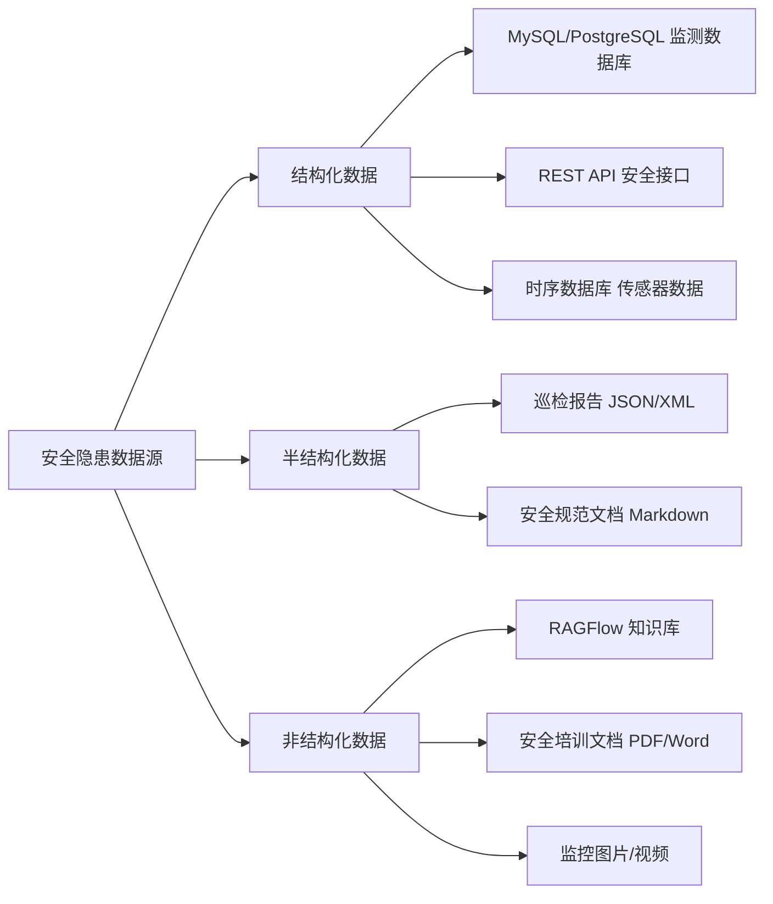
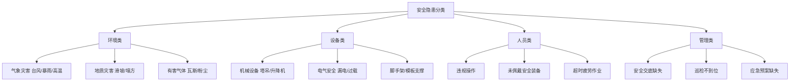
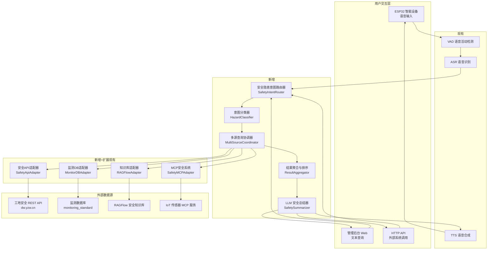
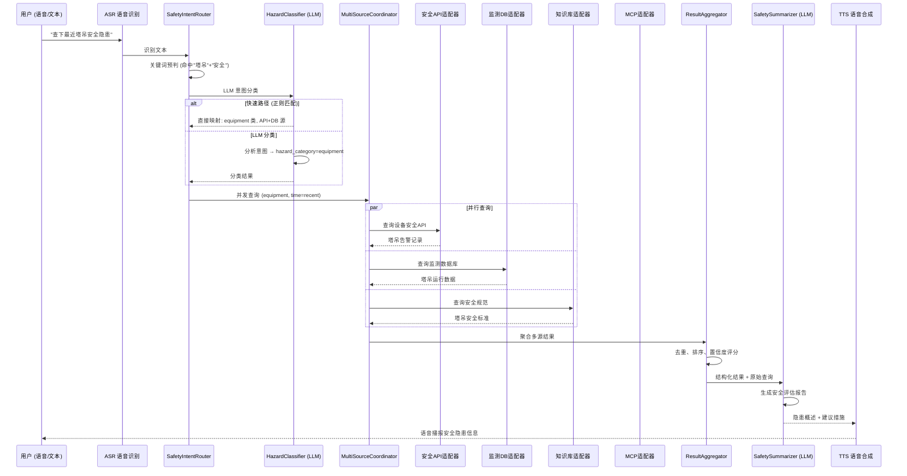
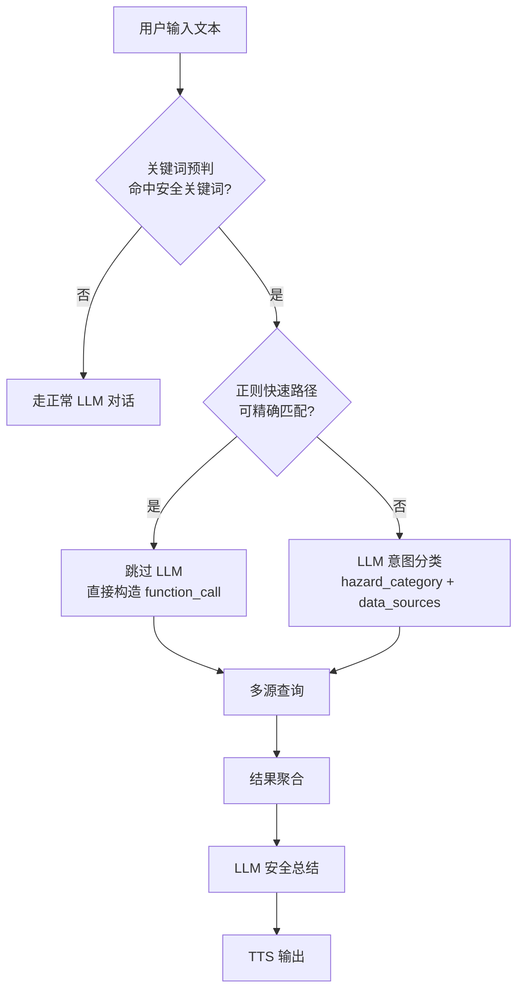
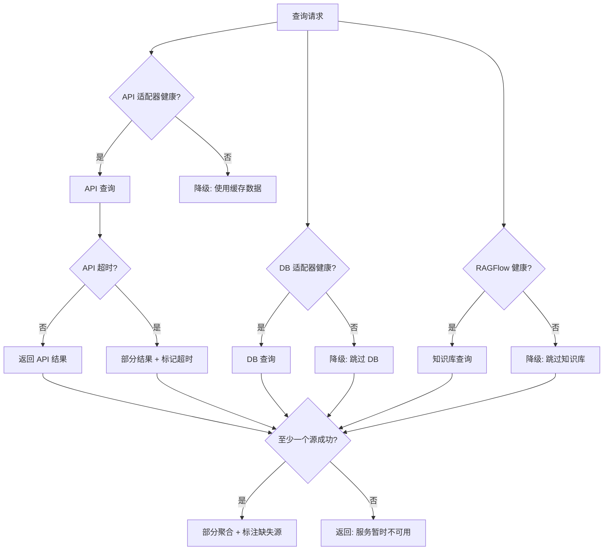

# 安全隐患信息检索 — 技术要点梳理 & 汇总方案设计

> 基于小智 AI 智能语音交互平台现有架构，设计安全隐患信息识别检索子系统。

---

## 目录

1. [技术要点梳理](#1-技术要点梳理)
2. [汇总方案设计](#2-汇总方案设计)
3. [检索流程架构](#3-检索流程架构)
4. [实施路线图](#4-实施路线图)

---

## 1. 技术要点梳理

### 1.1 现有能力盘点

小智 AI 平台已具备以下可直接复用的核心能力：

| 能力域 | 现有实现 | 复用方式 |
|--------|----------|----------|
| **语音交互管道** | OPUS → VAD → ASR → Intent → TTS → OPUS | 直接复用，安全隐患查询作为新意图分支 |
| **意图识别** | `intent_llm` / `function_call` 双模式 | 新增 `safety_hazard_query` 工具函数 + 技能提示 |
| **插件函数注册** | `@register_function` 装饰器 + `SkillHints` | 安全查询函数 + 技能关键词注册 |
| **多源数据查询** | RSA 签名 API（`staff_safe_query`）、MySQL DB（潮白河）、RAGFlow 知识库 | 扩展多数据源适配层 |
| **LLM 智能总结** | `replyResult` / `reply_result_with_skill_summary` | 安全隐患结果的结构化总结 |
| **MCP 协议集成** | Server/Device/Endpoint 三种 MCP 模式 | 安全隐患外部系统通过 MCP 接入 |
| **设备控制快速路径** | 正则匹配 → 直接 function_call（~0ms） | 高频安全查询可走快速路径 |
| **流式 TTS 输出** | 多提供商（豆包/阿里/火山/OpenAI 等） | 直接复用 |

### 1.2 核心挑战分析

| 挑战 | 描述 | 解决思路 |
|------|------|----------|
| **多源异构数据** | 安全隐患数据分布在 API、数据库、知识库、IoT 传感器等多个系统 | 统一数据源适配层 + 联邦查询引擎 |
| **语义理解准确性** | "高空作业有没有风险" vs "查下脚手架隐患" 需要准确映射 | LLM 意图分类 + 技能关键词 + Few-shot 示例 |
| **实时性要求** | 部分安全隐患（如气体泄漏）需要秒级响应 | 设备控制快速路径 + 异步推送告警 |
| **结果可信度** | LLM 可能产生幻觉，安全场景对准确性要求极高 | 源数据引用链 + 置信度评分 + 人工复核标记 |
| **权限与合规** | 安全数据涉及隐私和商业秘密 | 多级权限控制 + 操作审计日志 |

### 1.3 数据源分类



### 1.4 安全隐患分类体系



---

## 2. 汇总方案设计

### 2.1 总体架构



### 2.2 核心组件设计

#### 2.2.1 安全隐患意图路由器 (`SafetyIntentRouter`)

**位置**: `main/xiaozhi-server/core/handle/safety_hazard/`

在 `intentHandler.py` 的 `handle_user_intent()` 中新增安全隐患快速路由：

```python
# intentHandler.py 中新增（在设备控制快速路径之后、LLM 意图分析之前）

# ---- 安全隐患信息检索快速路由 ----
if _is_safety_hazard_query(text):
    safety_result = await _handle_safety_hazard_query(conn, text)
    if safety_result:
        return safety_result
```

**安全关键词预判**（可配置为独立 JSON 文件）：

```python
_SAFETY_HAZARD_KEYWORDS = [
    # 安全隐患通用
    "安全隐患", "安全风险", "风险点", "危险源", "危险",
    # 环境安全
    "台风", "暴雨", "高温", "滑坡", "塌方", "瓦斯", "有毒气体", "粉尘",
    # 设备安全
    "塔吊", "升降机", "脚手架", "模板", "漏电", "过载", "机械故障",
    # 人员安全
    "违规", "未戴安全帽", "安全带", "高空作业", "疲劳", "超时",
    # 管理安全
    "巡检", "安全交底", "应急预案", "安全培训",
]
```

#### 2.2.2 意图分类器 (`HazardClassifier`)

**设计思路**：
- 复用现有 `intent_llm` 模式的 LLM 调用
- 使用专用安全分类提示词，将用户查询映射到「类别 + 数据源 + 查询参数」
- 支持快速路径（正则匹配）跳过 LLM：

| 查询模式 | 正则示例 | 映射数据源 |
|----------|----------|------------|
| "XX 设备有没有隐患" | `(.+)有没有(隐患\|风险\|问题)` | 设备安全 API |
| "查下最近的告警" | `(最近\|今天\|本周).*(告警\|预警\|报警)` | 告警 API |
| "XX 区域安全吗" | `(.+)安全吗` | 多源综合评估 |
| "最近的天气对施工有什么影响" | `天气.*施工.*影响` | 天气 API + 安全规范知识库 |

#### 2.2.3 多源查询协调器 (`MultiSourceCoordinator`)

```python
class MultiSourceCoordinator:
    """
    协调多个数据源的并发查询，支持：
    - 并行查询（独立数据源）
    - 串行查询（有依赖关系）
    - 超时控制
    - 降级策略（某个源不可用时继续）
    """
    
    def __init__(self, adapters: List[DataSourceAdapter]):
        self.adapters = adapters
        self.timeout = 30  # 默认 30 秒
    
    async def query(self, hazard_type: str, params: dict) -> List[QueryResult]:
        """并发查询所有相关数据源"""
        tasks = []
        for adapter in self.adapters:
            if adapter.supports(hazard_type):
                tasks.append(adapter.query(params))
        results = await asyncio.gather(*tasks, return_exceptions=True)
        return [r for r in results if not isinstance(r, Exception)]
```

#### 2.2.4 数据源适配器接口

```python
from abc import ABC, abstractmethod
from dataclasses import dataclass, field
from typing import Any, Dict, List, Optional
from datetime import datetime

@dataclass
class HazardQueryResult:
    """安全隐患查询结果统一数据结构"""
    source: str                        # 数据来源标识
    source_type: str                   # api / db / knowledge_base / sensor
    hazard_category: str               # 隐患类别
    severity: str                      # 严重程度: critical / high / medium / low
    title: str                         # 标题
    summary: str                       # 摘要
    raw_data: Any                      # 原始数据
    confidence: float                  # 置信度 0-1
    timestamp: datetime                # 数据时间
    reference_url: Optional[str]       # 引用链接
    metadata: Dict[str, Any] = field(default_factory=dict)

class DataSourceAdapter(ABC):
    """数据源适配器抽象基类"""
    
    @abstractmethod
    def supports(self, hazard_type: str) -> bool:
        """判断是否支持该隐患类型"""
        ...
    
    @abstractmethod
    async def query(self, params: dict) -> List[HazardQueryResult]:
        """执行查询"""
        ...
    
    @abstractmethod
    def health_check(self) -> bool:
        """健康检查"""
        ...
```

**四种适配器实现**：

| 适配器 | 实现位置 | 说明 |
|--------|----------|------|
| `SafetyApiAdapter` | `adapters/safety_api_adapter.py` | 对接 `dw.yzw.cn` 安全 API，复用 `staff_safe_query.py` 的 RSA 签名逻辑 |
| `MonitorDBAdapter` | `adapters/monitor_db_adapter.py` | 对接监测数据库，复用 `intent_api_server.py` 的 SQL 解析 + LLM 分类 |
| `RAGFlowAdapter` | `adapters/ragflow_adapter.py` | 对接 RAGFlow 知识库，复用 `search_from_ragflow.py` |
| `SafetyMCPAdapter` | `adapters/safety_mcp_adapter.py` | 通过 MCP 协议接入 IoT 传感器等实时数据 |

#### 2.2.5 LLM 安全总结器 (`SafetySummarizer`)

```python
SAFETY_SUMMARY_PROMPT = """你是一个工地安全隐患智能分析助手。根据以下查询结果，生成安全评估报告。

查询问题：{user_query}
查询时间：{query_time}

数据来源及结果：
{aggregated_results}

请按以下结构输出：
1. **隐患概述**：一句话总结当前安全态势
2. **风险等级**：critical（立即处理）/ high（24h内）/ medium（本周内）/ low（持续关注）
3. **关键发现**：列出 2-3 条最重要的发现
4. **建议措施**：给出具体可操作的建议
5. **数据来源**：列出引用的数据来源

注意：
- 基于实际数据，不要编造信息
- 对严重隐患要明确标注 ⚠️
- 回复长度控制在 200-400 字
"""
```

### 2.3 插件函数注册

```python
# plugins_func/functions/safety_hazard_query.py

from plugins_func.register import register_function, ToolType, ActionResponse, Action
from plugins_func.skills.safety_hazard_skill import register_safety_hazard_skill

register_safety_hazard_skill()

@register_function(
    name="safety_hazard_query",
    desc="查询安全隐患信息，支持按类别、区域、时间范围查询",
    type=ToolType.WAIT
)
async def safety_hazard_query(
    query: str,
    hazard_category: str = None,
    time_range: str = None,
    area: str = None
) -> ActionResponse:
    """
    安全隐患信息检索主函数
    
    Args:
        query: 用户原始查询文本
        hazard_category: 隐患类别 (environment/equipment/human/process)
        time_range: 时间范围 (today/week/month/custom)
        area: 区域名称
    
    Returns:
        ActionResponse with REQLLM action
    """
    # ... 实现见下文
```

### 2.4 技能提示注册

```python
# plugins_func/skills/safety_hazard_skill.py

FEW_SHOT_EXAMPLES = [
    '用户: 查下最近的安全隐患\n'
    '返回: {"function_call": {"name": "safety_hazard_query", "arguments": {"query": "查下最近的安全隐患"}}}\n',
    
    '用户: 塔吊有没有风险\n'
    '返回: {"function_call": {"name": "safety_hazard_query", "arguments": {"query": "塔吊有没有风险", "hazard_category": "equipment"}}}\n',
    
    '用户: 今天气体监测数据\n'
    '返回: {"function_call": {"name": "safety_hazard_query", "arguments": {"query": "今天气体监测数据"}}}\n',
]

KEYWORDS = [
    "安全隐患", "安全风险", "危险源", "风险点",
    "塔吊安全", "脚手架安全", "高空作业安全",
    "气体监测", "有毒气体", "粉尘浓度",
    "违规操作", "安全帽", "安全带",
    "巡检情况", "安全检查", "安全评估",
]
```

---

## 3. 检索流程架构

### 3.1 主流程



### 3.2 快速路径 vs LLM 路径决策



### 3.3 数据源查询策略

| 查询类型 | API 源 | DB 源 | 知识库源 | MCP 源 | 优先级 |
|----------|--------|-------|----------|--------|--------|
| 实时告警查询 | ✅ 主 | - | - | ✅ 辅 | API > MCP |
| 历史趋势分析 | - | ✅ 主 | - | ✅ 辅 | DB > MCP |
| 安全规范咨询 | - | - | ✅ 主 | - | 知识库 |
| 设备状态查询 | ✅ 主 | ✅ 辅 | - | ✅ 辅 | API > DB > MCP |
| 综合安全评估 | ✅ | ✅ | ✅ | ✅ | 全源聚合 |
| 应急响应指导 | - | - | ✅ 主 | - | 知识库 |

### 3.4 异常处理与降级策略



### 3.5 项目文件结构

```
main/xiaozhi-server/
├── core/
│   └── handle/
│       ├── intentHandler.py                          # [修改] 新增安全查询路由
│       └── safety_hazard/                            # [新增] 安全隐患子系统
│           ├── __init__.py
│           ├── safety_intent_router.py               # 安全隐患意图路由器
│           ├── hazard_classifier.py                  # LLM 意图分类器
│           ├── multi_source_coordinator.py           # 多源查询协调器
│           ├── result_aggregator.py                  # 结果聚合与排序
│           ├── safety_summarizer.py                  # LLM 安全总结器
│           └── adapters/                             # 数据源适配器
│               ├── __init__.py
│               ├── base_adapter.py                   # 抽象基类 + 数据结构定义
│               ├── safety_api_adapter.py             # 工地安全 REST API
│               ├── monitor_db_adapter.py             # 监测数据库
│               ├── ragflow_adapter.py                # RAGFlow 知识库
│               └── safety_mcp_adapter.py             # MCP 安全系统
├── plugins_func/
│   ├── functions/
│   │   └── safety_hazard_query.py                    # [新增] 插件函数入口
│   └── skills/
│       └── safety_hazard_skill.py                    # [新增] 技能关键词+示例
└── config/
    └── safety_hazard_config.yaml                     # [新增] 安全隐患配置
```

---

## 4. 实施路线图

| 阶段 | 内容 | 工作量估计 | 依赖 |
|------|------|-----------|------|
| **Phase 1** | 数据源适配器开发（API + DB）+ 基础查询能力 | 3-5 天 | 现有 API/DB 可访问 |
| **Phase 2** | 安全隐患意图分类器 + 插件函数注册 + 技能提示 | 2-3 天 | Phase 1 |
| **Phase 3** | 多源协调器 + 结果聚合 + LLM 安全总结 | 2-3 天 | Phase 2 |
| **Phase 4** | 快速路径优化 + 异常降级 + 缓存策略 | 1-2 天 | Phase 3 |
| **Phase 5** | MCP 安全系统接入 + RAGFlow 知识库集成 | 2-3 天 | Phase 3 |
| **Phase 6** | 测试 + 调优 + 文档 | 2-3 天 | Phase 5 |
| **合计** | | **12-19 天** | |

### 关键里程碑

1. **M1** (Phase 2 完成)：用户可以说"查下最近安全隐患"，系统返回结构化 JSON
2. **M2** (Phase 3 完成)：用户获得自然语言安全评估报告
3. **M3** (Phase 5 完成)：多源数据融合查询，覆盖 API + DB + 知识库 + IoT
4. **M4** (Phase 6 完成)：生产就绪，包含完整的监控、告警、降级机制

---

## 附录 A: 与现有系统的集成点

| 集成点 | 文件位置 | 修改类型 |
|--------|----------|----------|
| 意图路由入口 | `core/handle/intentHandler.py:handle_user_intent()` | 新增分支 |
| 插件函数注册 | `plugins_func/functions/safety_hazard_query.py` | 新增文件 |
| 技能提示注册 | `plugins_func/skills/safety_hazard_skill.py` | 新增文件 |
| LLM 总结模板 | 复用 `reply_result_with_skill_summary()` | 新增 `summary_prompt` |
| 配置管理 | `config/safety_hazard_config.yaml` | 新增文件 |
| 工具上报 | 复用 `enqueue_tool_report()` | 无需修改 |

## 附录 B: 安全注意事项

1. **数据脱敏**：人员姓名、身份证号等敏感信息在 LLM 总结前脱敏
2. **访问控制**：安全隐患查询需要鉴权，记录操作审计日志
3. **幻觉防护**：LLM 生成的结论必须标注数据来源，不允许凭空推断
4. **限流保护**：对外 API 设置 QPS 限制，防止滥用
5. **敏感操作确认**：涉及安全预警下发、设备停机等操作需要二次确认
